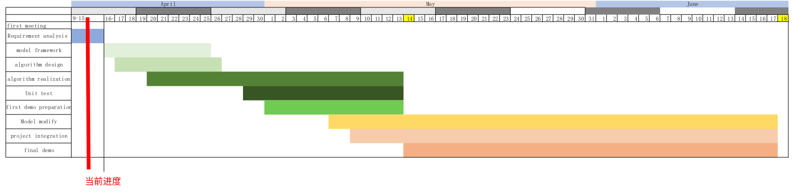
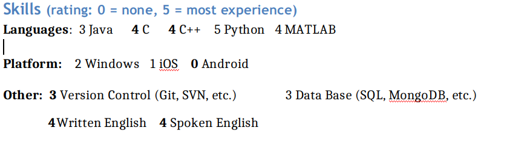
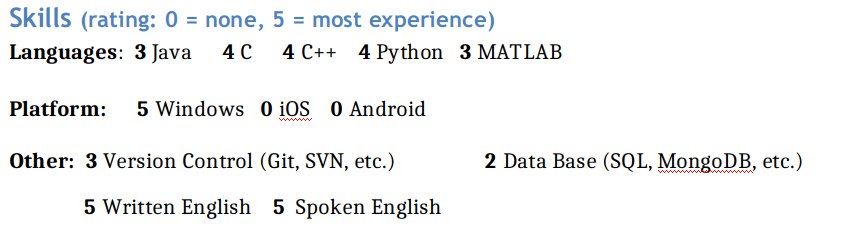
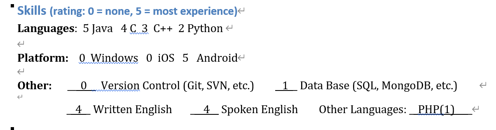
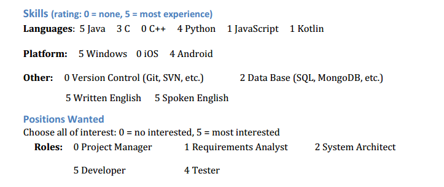
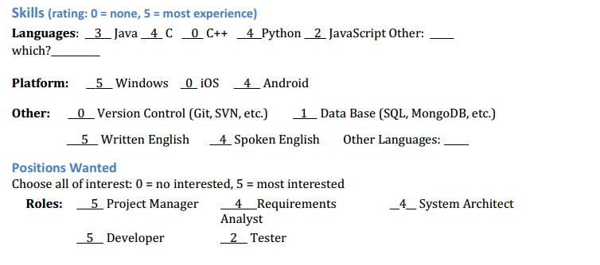
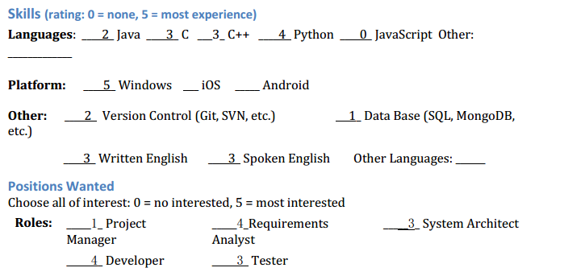

# Weekly report

week6
- **Doris Wang**
  1.Integrate code, 
  2.update GitHub page

- **Zachary CHEN**
  1. Further communicate with other groups to confirm requirements
  2. Revise the requirement document for multiple times.
  3. Assist in the communication of team members, including explaining the details of division of labor and the details of algorithm.
  
- **Carol Liao**
  1.complete the first version of SRS
  2 think up some architecture of the algorithm
  3 communicate with other group for the api
 
- **Diogo Mota**
  1. Communicated with other groups to review srs document.
  2. Started to learn deep learning by reading/studying the book: "Deep Learning with Python" by François Chollet
  
- **Afonso Mota**
  1. Communicated with team members in order to understand with more detail the approach used in the algorithm.
  2. Reviewed and contributed to srs document.
  
- **Cyan Fu**
  1. Research on algorithm
  2. homepage maintaining
  

# Our team 

Our team has developers who have experience in **developing Android**, researchers who are good at **medical imaging** (including key point detection and pathological image segmentation, and PM who is good at  management and project planning.....etc

 What's more, we are very happy to  communicate and cooperate with other people. I believe we will have a very pleasant project experience!

#### Yeap, so  join us!!!!!

### **Member**

#### PM

- **Doris Wang**
  

​		Email: wangyu13343911318@gmail.com 

> Intro: 
>
> I have served as the leader of multiple projects and topics, and have  some experience in project management and cooperation.
>
> I'm good at python,c++,java and learn some knowledge in deeplearning.
>
> And now I'm interested in computer vision, and so some work in medical imageing. I studied the hip joint, skull, scoliosis data set, and completed the task of key point detection and disease detection on it.

- **Zachary CHEN**
  

  Email: chen982330532@gmail.com

  

> Intro: 
>
> Firstly I am fluent in speaking English, so language will not be a barrier for our communication.
>
> Secondly I have the experience of cooperating with others as a team and I can fit in most roles assigned by project manager.
>
> Last but not least, I do have experience in medical image process, which may help our team in the project.

- **Carol Liao**
  
  Email: dreamy.lzx@gmail.com

> Intro: 
>
> I am working in developing an Android app which is good-structured.
>
> I do well in JAVA, which is popluar in both Android and server.
>
> I also have the experience of python coding which are useful in machine learning.
>
> I participated in lots of programming competition, winning the bronze in China Collegiate Programming Contest -WFinal hold by CCPC.
>
> The experience of programming competition makes me thinking more logical and structured.

- **Diogo Mota**
  
  Email: afonsomagmota@hotmail.com
> I am used to do group projects, so being part of a team is not anything new.
> I am totally comfortable using English to communicate and link up with new people. Last
> semester I did Erasmus in Slovakia where I made some friends from all Europe.

- **Afonso Mota**
  

  Email:  andrecibrao@gmail.com

- **Cyan Fu**
  
  Emial: 295046487@qq.com

> A little knowledge of Reinforcement Learning.
>
> Recently I’m doing some research on Reinforcement Learning and Bioinformatics.

